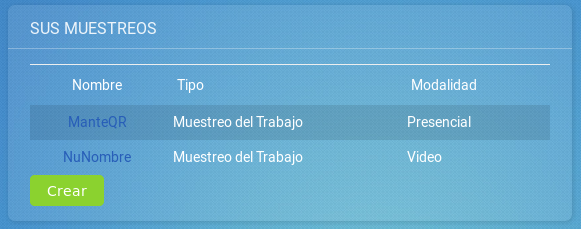

Muestreo del Trabajo
===

# Manual de Usuario
Este documento pretende prestar al lector una guía de consulta rápida sobre cómo ejecutar algún proceso o bien el significado de algún concepto.

## Índice
- [Colaborador](#colaborador)
  - [Agregar una observación](#agregar-una-observación)
  - [etc](#etc)
- [Administrador](#administrador)
  - [Crear un muestreo](#crear-un-muestreo)
- [Glosario](#Glosario)

## Colaborador
Describe las acciones que puede ejecutar un colaborador sobre un muestreo.

### Acciones

#### Agregar una observación
1. Iniciar sesión en la aplicación móvil.
2. Debe haber creado un recorrido, como se detalla [aquí](#crear-recorridos)
3. En el menú principal, click sobre "Crear observación"
4. Seleccionar un Muestreo
5. ... etc

## Administrador
Describe las acciones que puede ejecutar un administrador sobre su muestreo.

### Acciones

#### Crear un muestreo
1. Iniciar sesión en la aplicación web
2. Click sobre el botón verde que aparece en su perfil donde dice "Crear".
    <!-- Ojo que lleva 4 espacios, para mantener la jerarquía -->
    

3. Rellenar el formulario con los datos respectivos.
4. Enviar el formulario
5. Al refrescar su página, deberá aparecer listado bajo "Mis muestreos".

## Glosario
 - __Administrador__: Aquí va la definición
 - __Colaborador__:
 - __Muestreo__:
   - __Muestreo preliminar__:
   - __Muestreo definitivo__:
 - __Observación__:
 - __Actividad__:

## Consejos
1. Recuerde mantener segura su contraseña (?)
