Muestreo del Trabajo - Manual de Usuario
===

Este documento pretende prestar al lector una guía de consulta rápida sobre cómo ejecutar algún proceso o bien el significado de algún concepto.

## Índice
<!-- Los links, deben ir en minúscula y los espacios se sustituyen por guiones -->
<!-- La anidación de hace con separaciones de 2 espacios -->
- [Colaborador](#colaborador)
  - [Agregar una observación](#agregar-una-observación)
  - [Crear recorridos](#crear-recorridos)
  - [Agregar Actividad](#agregar-actividad)
  - [Agregar Comentario](#agregar-comentario)
  - [Agregar Anomalía](#agregar-anomalía)
- [Administrador](#administrador)
  - [Crear un muestreo](#crear-un-muestreo)
  - [Agregar Colaborador](#agregar-colaborador)
  - [Editar detalles del muestreo](#editar-detalles-del-muestreo)
  - [Editar parámetros preliminares](#editar-parámetros-preliminares)
  - [Editar parámetros definitivos](#editar-parámetros-definitivos)
  - [Hacer muestreo definitivo](#hacer-muestreo-definitivo)
  - [Agregar Actividad](#agregar-actividad)
  - [Consultar Productividad](#consultar-productividad)
  - [Consultar Actividades](#consultar-actividades)
  - [Resumen de Actividades](#resumen-actividades)
- [Glosario](#glosario)

## Colaborador
Describe las acciones que puede ejecutar un colaborador sobre un muestreo.

### Acciones

#### Agregar una observación
1. Iniciar sesión en la aplicación móvil.

2. Debe haber [creado un recorrido](#crear-recorridos).
<!-- Ojo que los números no importan. Solo el 1 debe ir de primero. -->
3. En el menú principal, click sobre "Muestrear"
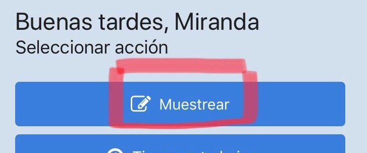

4. Seleccionar un muestreo de la lista brindada.

5. Seleccionar un recorrido de la lista.

6. Elegir la actividad que será observada.

7. Presionar botón de "Crear observación".
  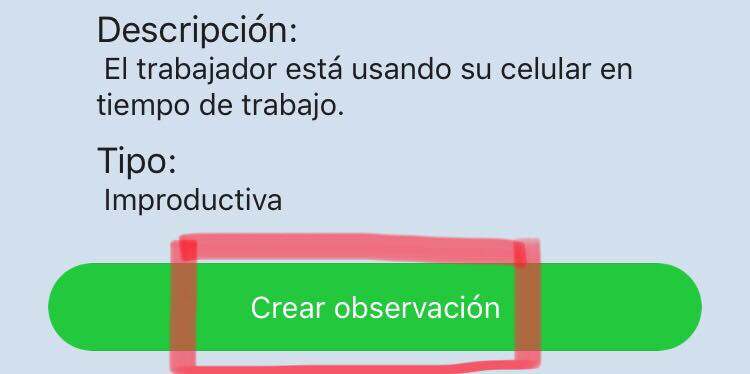

#### Crear recorridos
1. Seleccionar el rango de horas en el que se hará el recorrido.
2. Seleccinar el muestreo al que se agregará la observación.
3. Ingresar el tiempo que durará cada recorrido(en minutos).
4. Presionar botón de "Generar horarios".

#### Agregar Actividad
1. En el menú principal presionar el botón de "Muestrear".

2. Seleccionar un muestreo de la lista brindada.
3. Seleccionar un recorrido de la lista.
4. Presionar el botón con el símbolo de "+" para agregar la actividad.
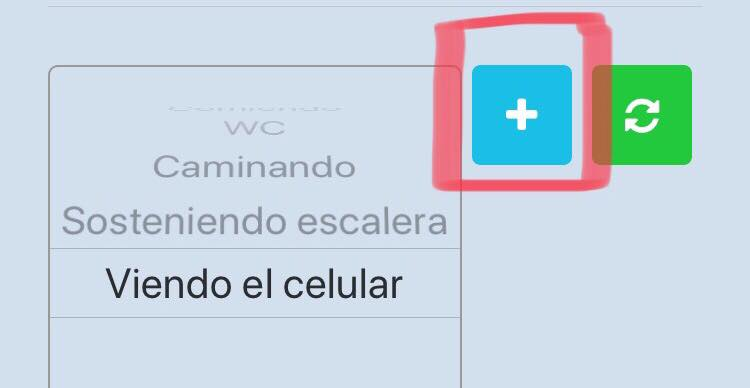
5. Ingresar nombre de la actividad.
6. Ingresar descripción de la actividad.
7. Ingresar tipo de actividad(improductiva, colaborativa , productiva).
8. Presionar el botón de "Agregar Actividad".
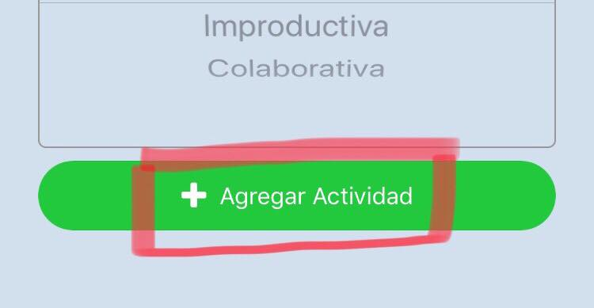

#### Agregar Comentario
1. Seleccionar el muestreo al que se agregará el comentario.

2. Ingresar el comentario dentro del campo provisto.
3. Presionar botón de "Agregar comentario".
  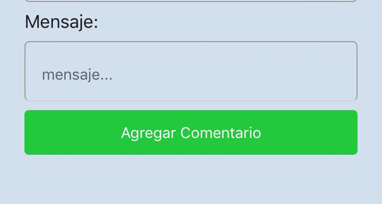

#### Agregar Reporte
1. Seleccionar el muestreo al que se agregará el reporte.

2. Ingresar la anomalía y especificar la fecha dentro del campo provisto.
3. Presionar botón de "Agregar Reporte".
  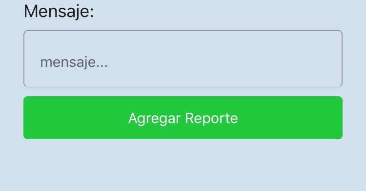

## Administrador
Describe las acciones que puede ejecutar un administrador sobre su muestreo.

### Acciones

#### Crear un muestreo
1. Iniciar sesión en la aplicación web.

2. Click sobre el botón verde que aparece en su perfil donde dice "Crear".
    <!-- Ojo que lleva 4 espacios, para mantener la jerarquía -->
    

3. Rellenar el formulario con los datos respectivos.
4. Enviar el formulario
5. Al refrescar su página, deberá aparecer listado bajo "Mis muestreos".

#### Agregar Colaborador
1. Ir a "Mis Muestreos".

2. Click sobre el botón de la izquierda para agregar colaborador.
    <!-- Ojo que lleva 4 espacios, para mantener la jerarquía -->
    
3. Elegir si se asigna como administrador o solo colaborador.
    
4. Presionar botón de "OK".

#### Editar detalles del muestreo
1. Ir a "Mis Muestreos".

2. Moverse a la sección de "Detalles del muestreo".
3. Ingresar el nuevo nombre para el muestreo.
4. Ingresar la nueva descripción para el muestreo.
5. Seleccionar de la lista el tipo de muestreo.
6. Ingresar el nuevo objecto que se va a muestrear.
7. Ingresar la nueva descripción del objeto a muestrear.
8. Presionar el botón amarillo para editar los detalles del muestreo.
  

#### Editar parámetros preliminares
1. Ir a "Mis Muestreos".

2. Moverse a la sección de "Parámetros" en el cuadro "Preliminares".
3. Presionar el botón de editar.
4. Ingresar el nuevo valor de n.
5. Ingresar el nuevo valor del error.
6. Presionar el icono de check para guardar o el icono X para cancelar.
  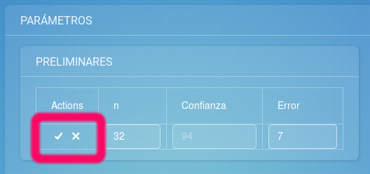

#### Editar parámetros definitivos
1. Ir a "Mis Muestreos".

2. Moverse a la sección de "Parámetros" en el cuadro "Definitivos".
3. Presionar el botón de editar.
4. Ingresar el nuevo valor de n.
5. Ingresar el nuevo valor del error E.
6. Presionar el icono de check para guardar o el icono X para cancelar.
  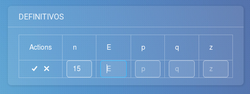
#### Hacer muestreo definitivo
1. Ir a "Mis Muestreos".

2. Moverse a la sección de "Parámetros".
3. Presionar el botón verde "Hacer definitivo".
  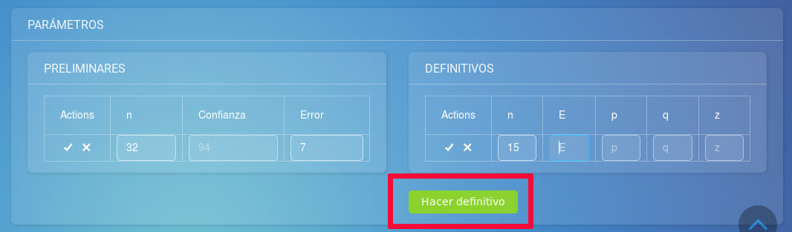
#### Agregar Actividad
1. Presionar botón para agregar una nueva Actividad.

   
2. Ingresar el nombre de la actividad.
3. Ingresar la descripción de la actividad.
4. Seleccionar el tipo de actividad(Productiva, Improductiva, Colaborativa).
5. Presionar botón para confirmar la adición de la actividad.
   

#### Consultar Productividad
1. Ir a "Analizar".

2. Seleccionar muestreo que desea consultar.
  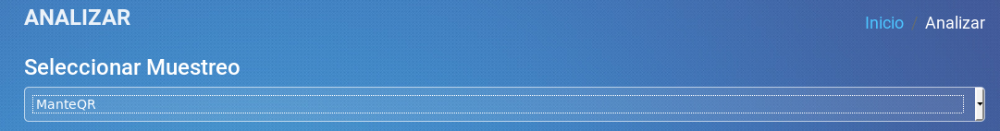
3. El gráfico "Productividad" muestra el promedio de productividad por dia y los comentarios registrados se denotan con un punto rojo.
  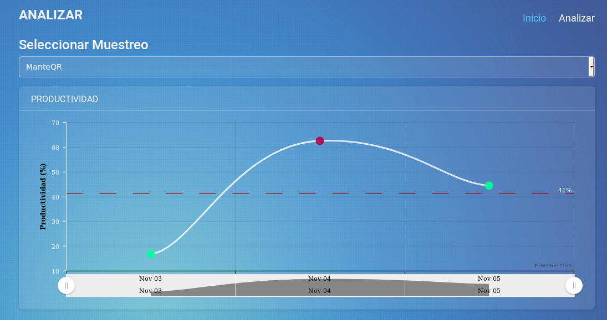
4. Para ver el comentario, poner el cursor sobre el punto rojo.
  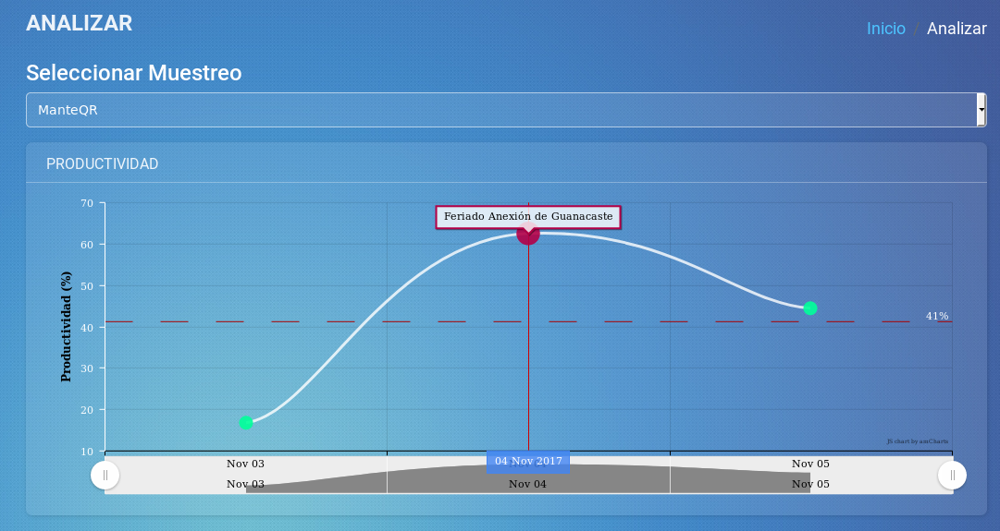
#### Consultar Actividades
1. Ir a "Analizar".

2. Seleccionar muestreo que desea consultar.
3. Se presentan tres gráficos, uno para actividades improductivas, colaborativas y productivas. Cada uno muestra el nombre de las actividades y el porcentaje en que se presenta para ese muestreo.
4. Si desea conocer la cantidad específica de observaciones tomadas con esa actividad, poner el cursor sobre el grafico en el color correspondiente a la actividad.
  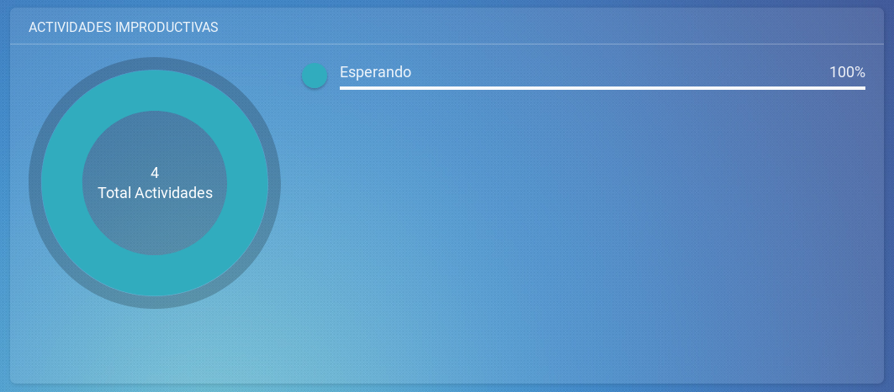

    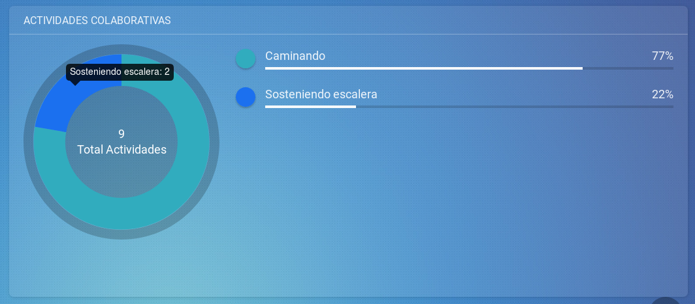

    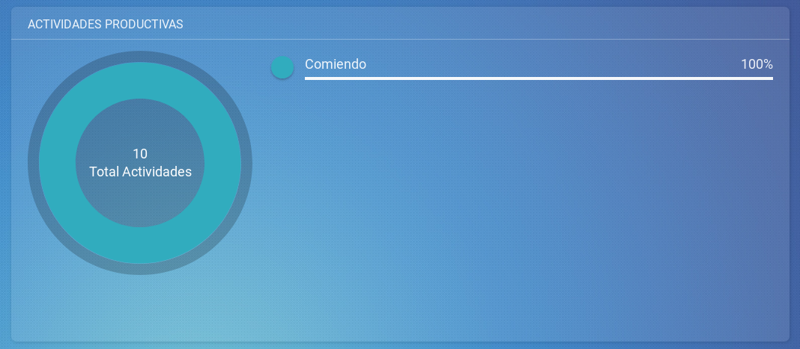
#### Resumen de Actividades
1. Ir a "Analizar".

2. Seleccionar muestreo que desea consultar.
3. El gráfico "Resumen de actividades" las actividades por tipo.
  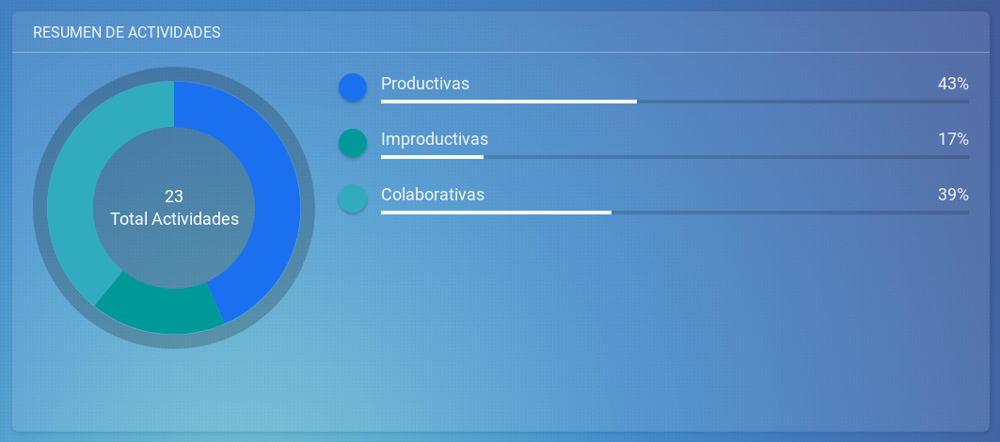

## Glosario
- __Administrador__: Usuario que puede realizar la administración absoluta de datos desde la aplicación web, puede realizar todas las funciones que se presentan en este manual y tambien el manejo de aplicación móvil.
- __Colaborador__: Usuario que puede realizar el manejo de la aplicación móvil para el registro de observaciones y actividades.
- __Muestreo__: Proceso a medir en el sistema. Se trata de un conjunto de observaciones sobre un determinado proceso donde se tienen unidades con responsabilidades definidas y luego se analizan las mismas para concluir si un proceso es productivo o no y cuáles serían las razones para las improductividades; esto para poder tomar medidas y aumentar la productividad del proceso.

  - _Muestreo preliminar_: muestreo que se realiza para tomar datos necesarios antes del muestreo definitivo, como tamaño de la muestra y definicion de actividades.
  - _Muestreo definitivo_: muestreo que se realiza con el tamaño total de la muestra tomando en cuenta los valores obtenidos en el preliminar.

- __Observación__: Es un conjunto de datos sobre alguna entidad donde se determina si la entidad está ejecutando su tarea asignada o si está haciendo algo que no aporte valor al proceso muestreado.
- __Actividad__: cualquier acción o estado que puede tener el objeto muestreado.
  - _Actividad Productiva_: Actividad que se considera que genera un resultado favorable en la productividad y corresponde a un trabajo asignado.
  - _Actividad Improdcutiva_:  Cualquiera de aquellas actividades alternativas que pueda estar siendo ejecutada por un trabajador observado, que no sea hacer su trabajo asignado.
  - _Actividad Colaborativa_:
Actividad que no aporta ningún valor para el proceso muestreado, sin embargo es necesaria para que otra actividad productiva se ejecute. Como por ejemplo, sostener una escalera.

- __Recorrido__: Trayecto en el cual se realizan las observaciones a un muestreo en un rango de tiempo determinado.
