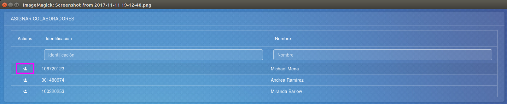
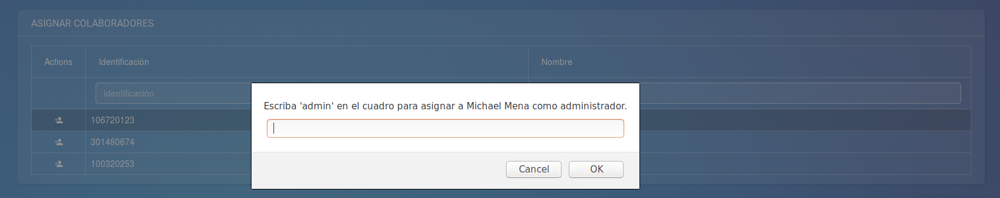
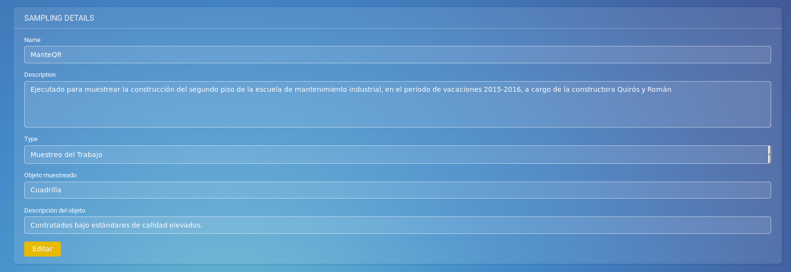
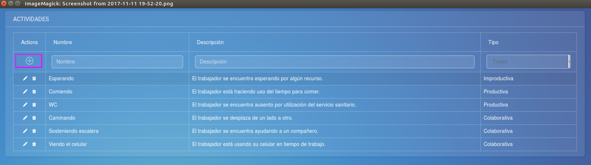
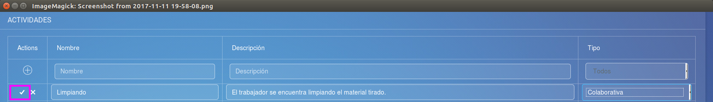

Muestreo del Trabajo - Manual de Usuario
===

Este documento pretende prestar al lector una guía de consulta rápida sobre cómo ejecutar algún proceso o bien el significado de algún concepto.

## Índice
<!-- Los links, deben ir en minúscula y los espacios se sustituyen por guiones -->
<!-- La anidación de hace con separaciones de 2 espacios -->
- [Colaborador](#colaborador)
  - [Agregar una observación](#agregar-una-observación)
  - [Crear recorridos](#crear-recorridos)
  - [Agregar Comentario](#agregar-comentario)
  - [Agregar Anomalía](#agregar-anomalía)
- [Administrador](#administrador)
  - [Crear un muestreo](#crear-un-muestreo)
  - [Agregar Colaborador](#agregar-colaborador)
  - [Editar detalles del muestreo](#editar-detalles-del-muestreo)
  - [Editar parámetros preliminares](#editar-parámetros-preliminares)
  - [Editar parámetros definitivos](#editar-parámetros-definitivos)
  - [Hacer muestreo definitivo](#hacer-muestreo-definitivo)
  - [Agregar Actividad](#agregar-actividad)
- [Glosario](#glosario)

## Colaborador
Describe las acciones que puede ejecutar un colaborador sobre un muestreo.

### Acciones

#### Agregar una observación
1. Iniciar sesión en la aplicación móvil.
2. Debe haber [creado un recorrido](#crear-recorridos).
<!-- Ojo que los números no importan. Solo el 1 debe ir de primero. -->
3. En el menú principal, click sobre "Crear observación"
7. Seleccionar un Muestreo
5. ... etc

#### Crear recorridos
1. Seleccionar el rango de horas en el que se hará el recorrido.
2. Seleccinar el muestreo al que se agregará la observación.
3. Ingresar el tiempo que durará cada recorrido(en minutos).
4. Presionar botón de "Generar horarios".

#### Agregar Comentario
1. Seleccionar el muestreo al que se agregará el comentario.
2. Ingresar el comentario dentro del campo provisto.
3. Presionar botón de "Continuar".

#### Agregar Anomalía
1. Seleccionar el muestreo al que se agregará la anomalía.
2. Ingresar la anomalía y especificar la fecha dentro del campo provisto.
3. Presionar botón de "Continuar".

## Administrador
Describe las acciones que puede ejecutar un administrador sobre su muestreo.

### Acciones

#### Crear un muestreo
1. Iniciar sesión en la aplicación web.
2. Click sobre el botón verde que aparece en su perfil donde dice "Crear".
    <!-- Ojo que lleva 4 espacios, para mantener la jerarquía -->
    

3. Rellenar el formulario con los datos respectivos.
4. Enviar el formulario
5. Al refrescar su página, deberá aparecer listado bajo "Mis muestreos".

#### Agregar Colaborador
1. Ir a "Mis Muestreos".
2. Click sobre el botón de la izquierda para agregar colaborador.
    <!-- Ojo que lleva 4 espacios, para mantener la jerarquía -->
    
3. Elegir si se asigna como administrador o solo colaborador.
    
4. Presionar botón de "OK".

#### Editar detalles del muestreo
1. Ir a "Mis Muestreos".
2. Moverse a la sección de "Detalles del muestreo".
3. Ingresar el nuevo nombre para el muestreo.
4. Ingresar la nueva descripción para el muestreo.
5. Seleccionar de la lista el tipo de muestreo.
6. Ingresar el nuevo objecto que se va a muestrear.
7. Ingresar la nueva descripción del objeto a muestrear.
8. Presionar el botón amarillo para editar los detalles del muestreo.
  

#### Editar parámetros preliminares

#### Editar parámetros definitivos

#### Hacer muestreo definitivo

#### Agregar Actividad
1. Presionar botón para agregar una nueva Actividad.
   
2. Ingresar el nombre de la actividad.
3. Ingresar la descripción de la actividad.
4. Seleccionar el tipo de actividad(Productiva, Improductiva, Colaborativa).
5. Presionar botón para confirmar la adición de la actividad.
   

#### Consultar Productividad
1.
2.
3.

#### Consultar Actividades Improductivas

## Glosario
- __Administrador__: Aquí va la definición
- __Colaborador__:
- __Muestreo__:
  - _Muestreo preliminar_:
  - _Muestreo definitivo_:
- __Observación__:
- __Actividad__:
- __Recorrido__:

## Consejos
1. Recuerde mantener segura su contraseña (?)
